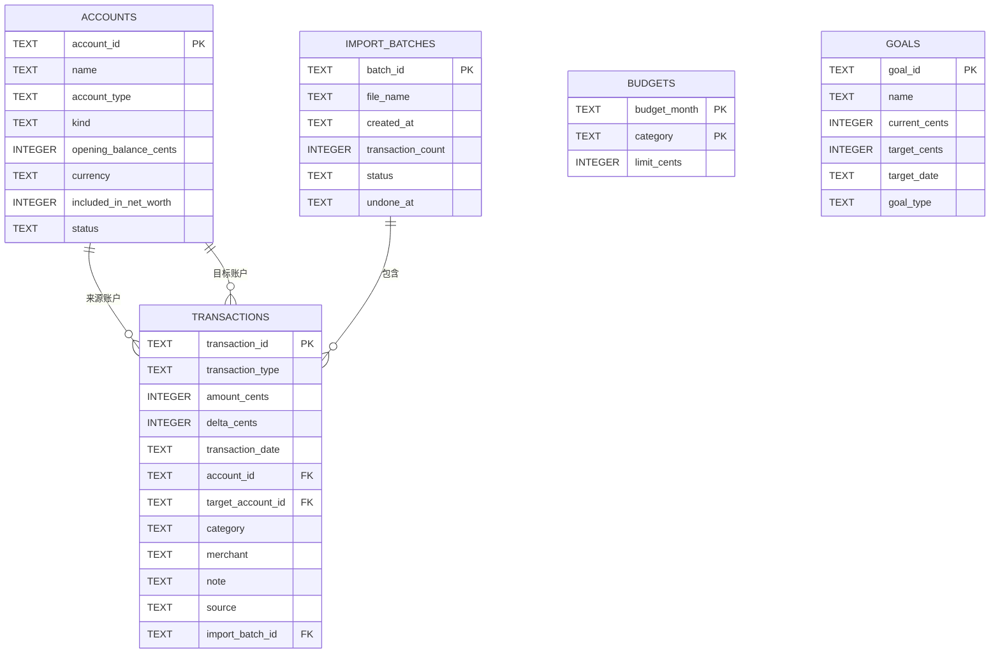

# 一目个人财务看板：数据库设计

## 1. 设计目标

交付版使用 SQLite 保存账户、交易、预算、目标和导入批次。数据库由 Java 17 本地服务独占写入；所有状态更新在单一事务内完成，并启用外键约束。完整建表脚本见 [`database/schema.sql`](../database/schema.sql)。

## 2. ER 图



## 3. 表结构说明

| 表 | 主键 | 外键/唯一约束 | 用途 |
| --- | --- | --- | --- |
| `accounts` | `account_id` | `kind` 仅允许资产或负债 | 账户基础信息和期初余额 |
| `transactions` | `transaction_id` | 来源/目标账户关联 `accounts`；批次关联 `import_batches` | 收入、支出、转账及余额调整事实 |
| `budgets` | `budget_month, category` | 联合主键防止同月同分类重复预算 | 分类月度预算 |
| `goals` | `goal_id` | 金额非负、目标金额大于零 | 储蓄与还债目标 |
| `import_batches` | `batch_id` | 无 | 导入来源、数量和撤销状态 |
| `app_meta` | `meta_key` | 无 | 记录数据库是否完成首次初始化 |

金额统一使用整数“分”，日期和时间使用 ISO 文本。`transactions` 在日期、账户和导入批次上建立索引，以支持月度汇总、账户明细和批次撤销。

## 4. 持久化流程

```text
浏览器 FinanceStore 发布变更
  -> Persistence Adapter 发送 PUT /api/state
  -> Java 服务校验请求结构和 2MB 上限
  -> SQLite 事务删除旧快照并按外键顺序写入规范化表
  -> 提交事务
  -> 下次启动通过 GET /api/state 恢复状态
```

若使用 `npm start` 启动纯前端开发服务器，状态接口不可用，适配器会自动回退到 `localStorage`；最终提交和答辩应使用 `run.bat` 验证 SQLite 路径。
