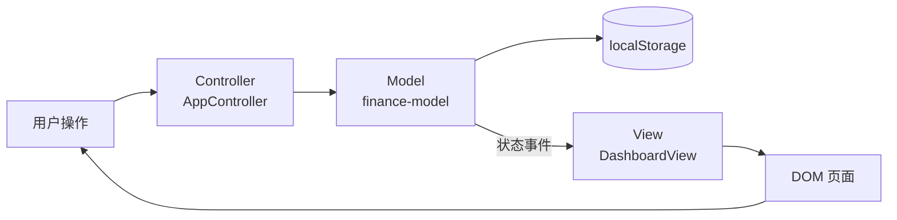
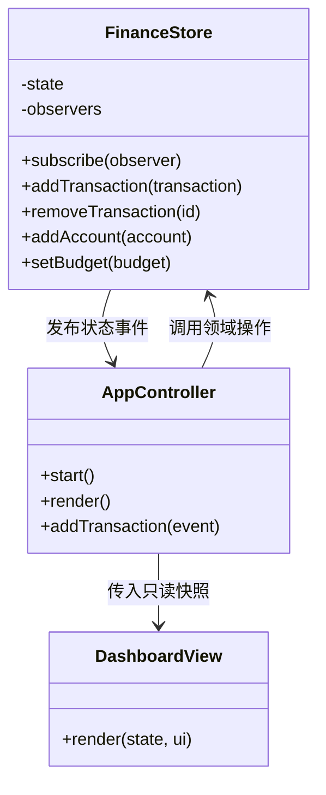

# 一目个人财务看板：Web MVP 技术设计

| 项目 | 内容 |
| --- | --- |
| 版本 | v0.1 |
| 更新日期 | 2026-09-14 |
| 技术形态 | 原生 JavaScript 响应式 Web 应用 |
| 数据模式 | 浏览器本地优先 |

## 1. 实现目标

第一版聚焦“账户—交易—预算—看板”闭环：用户记录一笔交易后，账户余额、净资产、现金流、图表和预算进度在同一次状态变更中刷新。实现不依赖第三方运行时库，便于在实训环境中直接启动、阅读和演示。

当前版本是可运行的课程实训 MVP，不包含登录、云端同步、多人协作和服务端数据库。若进入真实生产环境，需要补充后端身份认证、数据库事务、加密和备份策略。

## 2. MVC 体系结构



- Model：保存账户、交易、预算和目标数据，负责整数分金额计算、账户余额、月度汇总、预算状态、CSV 解析和重复识别。
- View：把只读状态渲染为看板、交易、账户和预算四个页面，不直接修改业务数据。
- Controller：接收导航、表单、筛选、导入和导出事件，校验交互规则后调用 Model，再驱动 View 更新。
- Persistence：Model 每次成功变更后，将状态快照写入 `localStorage`。该适配点可在后续替换为 REST API。

代码位置：

```text
src/
├── app.js                         # 组装入口
├── controller/app-controller.js  # Controller
├── model/finance-model.js         # Model 与领域规则
├── view/dashboard-view.js         # View
└── data/seed-data.js              # 首次体验数据
```

## 3. 观察者模式

`createFinanceStore` 是主题（Subject），View 订阅它的状态变更。新增交易、删除交易、添加账户、导入数据或修改预算后，Store 发布具名事件；Controller 收到通知并重新渲染。这使业务变更与具体 DOM 操作解耦。



## 4. 关键业务规则

所有金额使用整数“分”存储和累计，避免浮点误差。

- 资产账户：收入增加余额，支出和转出减少余额，转入增加余额。
- 负债账户：消费增加未偿金额，还款转入减少未偿金额。
- 转账只影响相关账户余额，不计入收入、支出和净现金流。
- 净资产等于资产账户余额之和减去负债账户未偿金额之和。
- 预算使用率低于 80% 为正常，达到 80% 为提醒，达到 100% 为超支。
- 收入为零时，结余率显示为“不适用”，避免产生无穷或无意义百分比。
- CSV 疑似重复由日期、金额、账户和商户的组合指纹识别；用户确认后跳过重复项。

## 5. 数据对象

```text
Account     { id, name, type, kind, openingBalanceCents }
Transaction { id, type, amountCents, date, accountId, targetAccountId?, category, merchant?, note?, source }
Budget      { month, category, limitCents }
Goal        { id, name, currentCents, targetCents, targetDate }
```

交易是余额和报表的可追溯来源。账户只保存期初余额，当前余额由期初余额与全部相关交易推导。

## 6. CSV 导入格式

首行必须使用以下中文字段名：

```csv
日期,类型,金额,账户,分类,商户,备注
2026-09-08,支出,28.50,现金,餐饮,"好味道,一店",午餐
```

类型支持“收入”“支出”“转账”或对应英文值。金额以元输入，导入后转换为整数分。若账户名称无法匹配，当前版本会使用第一个账户，并通过后续版本的字段映射界面解决这一限制。

## 7. 测试策略

- 领域单元测试：账户余额、净资产、现金流、预算边界、CSV 和观察者通知。
- 结构测试：MVC 组装、核心页面、原生对话框、隐私入口、移动端与键盘支持。
- 浏览器冒烟测试：新增交易、关键词搜索、类型筛选、新增预算、桌面和移动截图以及控制台错误。

运行 `npm run validate` 执行 Node 测试与 Markdown 链接检查。浏览器回归脚本位于 `tests/browser-smoke.py`。

## 8. 安全边界

当前主要信任边界是浏览器表单、CSV 文件和本地 HTTP 请求；主要资产是用户录入的财务数据。针对本地 MVP 已采用以下控制：

- 所有写入 `innerHTML` 的用户字段都经过 HTML 编码，避免交易备注或商户名称形成脚本。
- CSV 内容上限为 2MB，金额和交易类型在进入 Store 前校验。
- 本地服务器只接受 `GET` 和 `HEAD`，解析并约束静态文件路径，拒绝路径穿越请求。
- 静态响应包含 CSP、禁止 MIME 嗅探、禁止嵌入和不发送来源信息等安全响应头。
- 项目没有第三方运行时依赖、远程脚本、身份令牌或源码内密钥。

本地存储不是服务端安全边界，同一浏览器配置下能运行脚本的人可能读取数据。因此当前版本不声称提供多用户隔离；云端版本必须重新完成身份认证、授权、传输加密和静态加密威胁建模。

## 9. 后续演进

1. 将 Store 持久化适配器替换为后端 REST API 和关系数据库，并保持 View/Controller 接口不变。
2. 增加用户身份认证、密码哈希、服务端授权和安全审计。
3. 完成 CSV 字段映射、导入批次记录与整批撤销。
4. 增加交易编辑、分类和标签维护、目标进度更新。
5. 对高数据量列表加入分页或虚拟滚动，并增加端到端性能基线。
